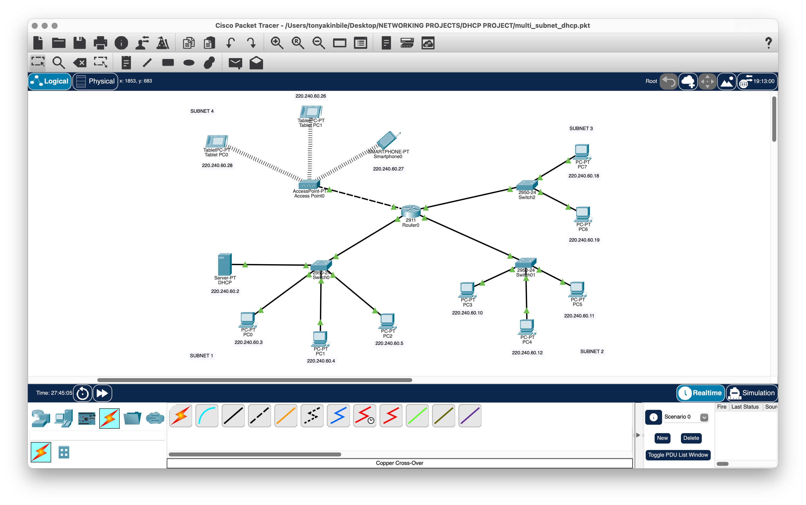
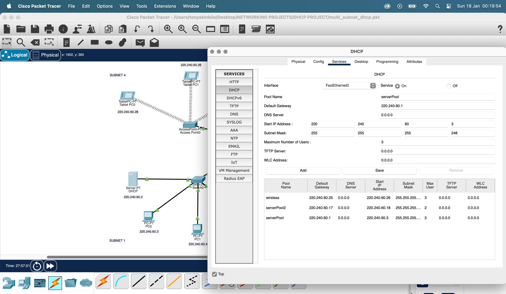
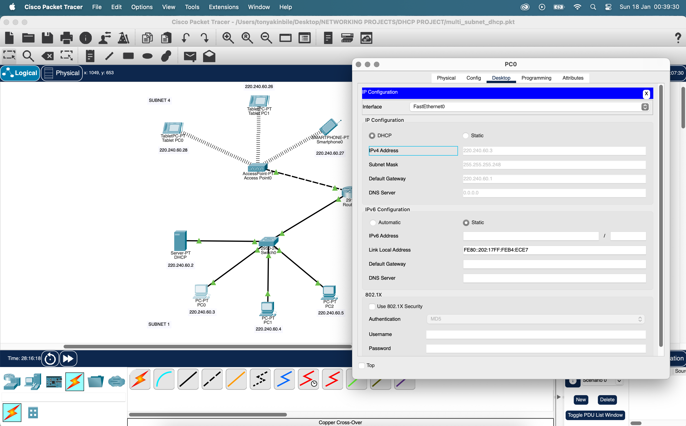
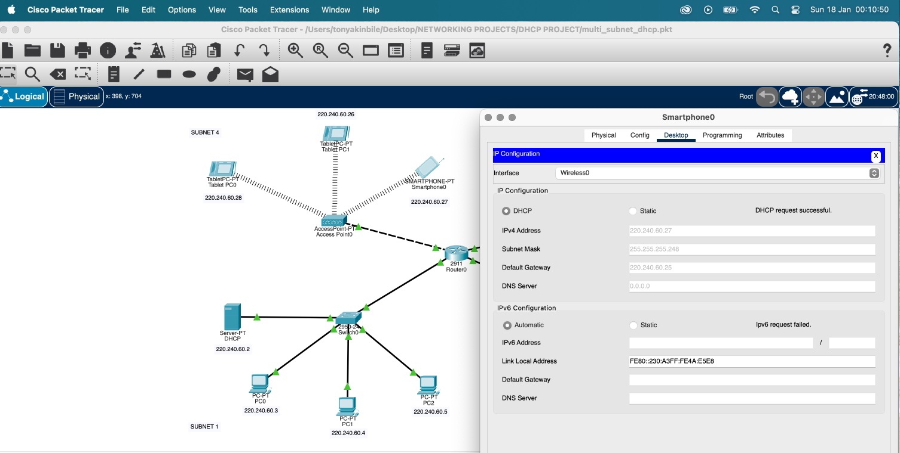
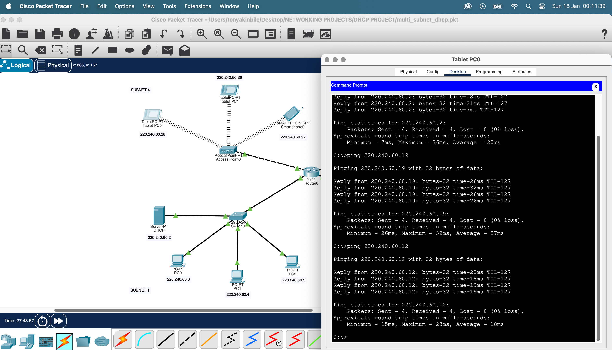

# packet-tracer-multi-subnet-network
Cisco Packet Tracer project demonstrating VLSM subnetting, inter VLAN routing, DHCP relay, and wireless network integration.

For a detailed explanation of the network design, subnetting decisions, and routing strategy, see the [Network Overview](docs/network-overview.md).

## What This Project Demonstrates

- Multi-subnet design using VLSM
- Inter-VLAN routing via a central router
- Centralized DHCP serving multiple subnets
- Wired and wireless client integration
- End-to-end connectivity validation

## Project Walkthrough (Visual)

### Network Topology
  
Overall logical topology showing segmented subnets, routing device, DHCP server, and wireless access point.

### DHCP Server Configuration
  
Central DHCP server configured with multiple address pools to serve different subnets.

### Wired Client DHCP Assignment
  
Wired client successfully receiving an IP address via DHCP.

### Wireless Client DHCP Assignment
  
Wireless client receiving an IP address through the access point.

### Inter-Subnet Connectivity Test
  
Ping results confirming successful communication between different subnets.

## Design Details
For a deeper explanation of subnetting, routing, and design decisions, see:
👉 [Network Overview](docs/network-overview.md)
